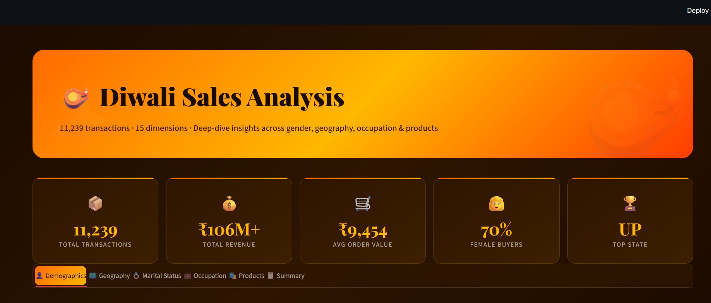
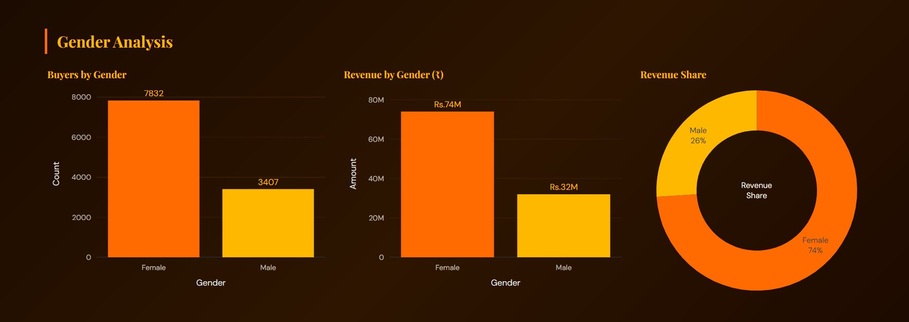
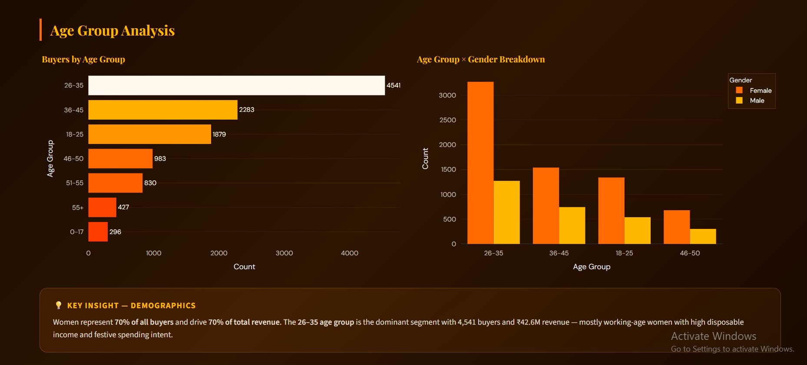

# 🪔 Diwali Sales Analysis Dashboard

<div align="center">


**A richly styled, interactive Streamlit dashboard that uncovers deep buying patterns from 11,239 Diwali transactions across India.**

[Live Demo](https://diwali-analysis-dashboard-python-39s5k4bxmtfygfwsblvvts.streamlit.app/) · [Report Bug](../../issues) · [Request Feature](../../issues)

</div>

---

## 🖼️ Preview

<div align="center">
  
  <br/><br/>
  
  <br/><br/>
  
</div>

---

## ✨ Overview

This dashboard transforms raw Diwali sales data into actionable business intelligence — presented in a warm saffron-and-gold festive theme. It covers everything from gender & age demographics to state-level geography, occupation segments, and best-selling products.

> 🎯 **Key Finding:** Married women aged 26–35, working in IT/Healthcare/Aviation, living in UP, Maharashtra or Karnataka — are the #1 customer segment, driving **₹74M of ₹106M+** total revenue.

---

## 📊 Dashboard Sections

| Tab | What You'll See |
|-----|----------------|
| 👤 **Demographics** | Gender split (buyers + revenue), age group breakdown, age × gender cross-tab |
| 🗺️ **Geography** | Top 10 states by order volume & revenue, choropleth-style bar charts |
| 💍 **Marital Status** | Married vs unmarried counts, revenue waterfall by gender × marital status |
| 💼 **Occupation** | Customer count & revenue by profession, scatter plot of volume vs spend |
| 🛍️ **Products** | Category orders & revenue, bubble chart, top 10 best-selling products |
| 📋 **Executive Summary** | Ideal customer profile, key findings, strategic recommendations |

---

## 📈 Key Metrics at a Glance

```
📦  11,239   Total Transactions
💰  ₹106M+   Total Revenue
🛒  ₹9,454   Average Order Value
👩  70%      Female Buyers
🏆  UP       Top State by Revenue
```

---

## 🛠️ Tech Stack

- **[Streamlit](https://streamlit.io/)** — App framework & layout
- **[Plotly Express & Graph Objects](https://plotly.com/python/)** — Interactive charts (bar, pie, scatter, waterfall)
- **[Pandas](https://pandas.pydata.org/)** — Data wrangling
- **[NumPy](https://numpy.org/)** — Numerical support
- **Custom CSS** — Playfair Display + DM Sans typography, saffron gradient theme

---

## 🚀 Getting Started

### Prerequisites

Make sure you have Python 3.8+ installed.

### Installation

1. **Clone the repository**
   ```bash
   git clone https://github.com/your-username/diwali-sales-dashboard.git
   cd diwali-sales-dashboard
   ```

2. **Install dependencies**
   ```bash
   pip install streamlit pandas numpy plotly
   ```

3. **Run the app**
   ```bash
   streamlit run diwali_dashboard.py
   ```

4. Open your browser at `http://localhost:8501` 🎉

---

## 📁 Project Structure

```
diwali-sales-dashboard/
│
├── diwali_dashboard.py    # Main Streamlit app
├── README.md              # You are here
└── requirements.txt       # (optional) Pin your dependencies
```

---

## 💡 Business Insights

- **Gender:** Females make up 70% of buyers and contribute 70% of revenue (₹74M vs ₹32M)
- **Age:** The 26–35 group is the largest segment — 4,541 buyers, ₹42.6M revenue
- **Geography:** UP, Maharashtra & Karnataka together account for ~45% of all orders
- **Occupation:** IT, Healthcare & Aviation professionals are the top spenders
- **Products:** Food leads revenue (₹35M), Clothing leads order count
- **Top Product:** `P00265242` — bestseller with 130+ orders; stock deeply before peak season

---

## 🎨 Design Highlights

The dashboard uses a custom festive colour palette inspired by Diwali:

| Colour | Hex | Used For |
|--------|-----|----------|
| 🟠 Saffron | `#FF6B00` | Primary accents, borders |
| 🟡 Gold | `#FFB800` | KPI values, chart titles |
| 🔴 Deep Orange | `#FF3D00` | Gradient start, highlights |
| 🟤 Deep Warm | `#1A0A00` | Background |
| 🟫 Cream | `#FFF8EE` | Body text |

---

## 🤝 Contributing

Contributions are welcome! Feel free to open an issue or submit a pull request.

1. Fork the project
2. Create your feature branch: `git checkout -b feature/AmazingFeature`
3. Commit your changes: `git commit -m 'Add AmazingFeature'`
4. Push to the branch: `git push origin feature/AmazingFeature`
5. Open a Pull Request

---

## 📜 License

Distributed under the MIT License. See `LICENSE` for more information.

---

<div align="center">

🪔 Built with passion for data · Powered by Streamlit & Plotly

</div>
